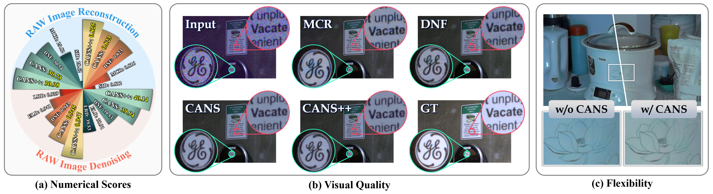
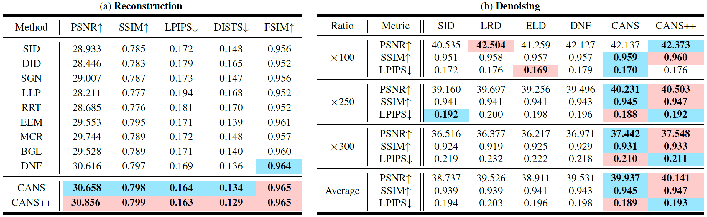
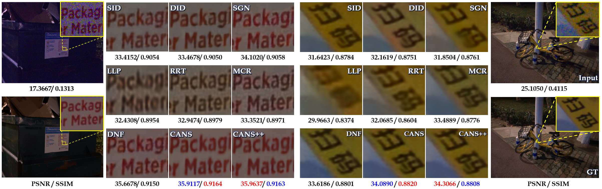
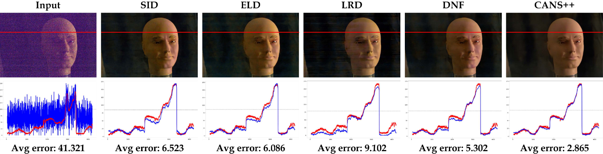
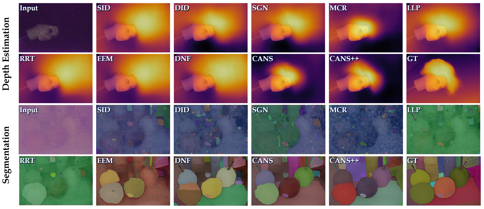

# Rethinking Reconstruction and Denoising in the Dark:New Perspective, General Architecture and Beyond
## :star:Accepted by CVPR 2025
This is a Pytorch implementation of Rethinking Reconstruction and Denoising in the Dark:New Perspective, General Architecture and Beyond in CVPR 2025, by Tengyu Ma, Long Ma, Ziye Li,Yuetong Wang,Jinyuan Liu,Chengpei Xu, and Risheng Liu.

Comparison among recent state-of-the-art methods and our method.


## 🚩Abstract
Recently, enhancing image quality in the original RAW domain has garnered significant attention, with denoising and reconstruction emerging as fundamental tasks. Although some works attempt to couple these tasks, they primarily focus on multi-stage learning while neglecting task associativity within a broader parameter space, leading to suboptimal performance. This work introduces a novel approach by rethinking denoising and reconstruction from a “backbone-head” perspective, leveraging the stronger shared parameter space offered by the backbone, compared to the encoder used in existing works. We derive task specific heads with fewer parameters to mitigate learning pressure. By incorporating chromaticity-aware attention into the backbone and introducing an adaptive denoising prior during training, we enable simultaneous reconstruction and denoising. Additionally, we design a dual-head interaction module to capture the latent correspondence between the two tasks, significantly enhancing multi-task accuracy. Extensive experiments validate the superiority of the proposed method.


## 😊Dependencies and Installation 
1.**Clone Repo**

 `git clone https://github.com/csmty/CANS.git`

2.**Create Conda Environment and install Dependencies**
```bash
conda create -n CANS python=3.10
conda activate CANS
pip install -r requirements.txt -f https://download.pytorch.org/whl/cu121/torch_stable.html
```

## 🎬Training & Testing

1.You can change the input dataset path and the output path by modifying the paths in the ```configs/CANS_Plus/Sony.yaml``` file. 

2.You can perform training and testing through the following commands:
```sh train.sh, sh test.sh. ```


## :sunny:Quantitative comparison results

## :pushpin:Comparison results of the reconstruction task

## :checkered_flag:Comparison results of the denoising task

## :paw_prints:Images captured in real-world scenarios

## ⚡Results on High-level Vision Tasks

## :triangular_flag_on_post: Citation
If you use our code and dataset for research, please cite our paper:

```bibtex
@inproceedings{ma2025rethinking,
  title={Rethinking Reconstruction and Denoising in the Dark: New Perspective, General Architecture and Beyond},
  author={Ma, Tengyu and Ma, Long and Li, Ziye and Wang, Yuetong and Liu, Jinyuan and Xu, Chengpei and Liu, Risheng},
  booktitle={Proceedings of the Computer Vision and Pattern Recognition Conference},
  pages={2323--2332},
  year={2025}
}
```


## :mailbox_with_mail: Contacts 
If you have any questions or suggestions about this repo, please feel free to contact me (tyma0913@gmail.com).


## :clipboard: Acknowledgments
This repository borrows heavily from [DNF](https://github.com/Srameo/DNF). Thanks for their outstanding contributions.
